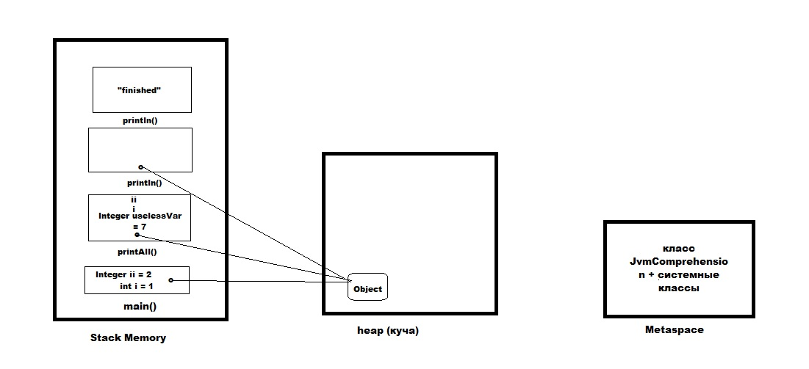

1. Загружается класс JvmComprehension в Application ClassLoader+стандартные классы, помещается в Metaspace
в момент вызова метода main создается фрейм в стеке (main())
1. в нем инициализируется переменная  int i = 1
2. в куче создается объект Object. В стеке во фрейме main создается локальная переменная о
3. в стеке во фрейме main создается переменная Integer ii = 2
4. в момент вызова метода printAll(o, i, ii) в стеке создается еще один фрейм printAll()
5. во фрейме метода printAll создается переменная o (которая содержит ссылку на ранее 
созданный объект Object в куче), переменная i, переменная ii создается локальная переменная Integer uselessVar = 7
1. в стеке создается еще один фрейм метода println класа System, 
где создается переменная o со ссылкой на объект Object
т.к. мы дошли до конца метода println, указатель стека сдигается вниз на фрейм метода printAll,
 далее аналогично переходим во фрейм метода main
 1. в стеке создается еще один фрейм метода println класа System c переменной "finished"
  

